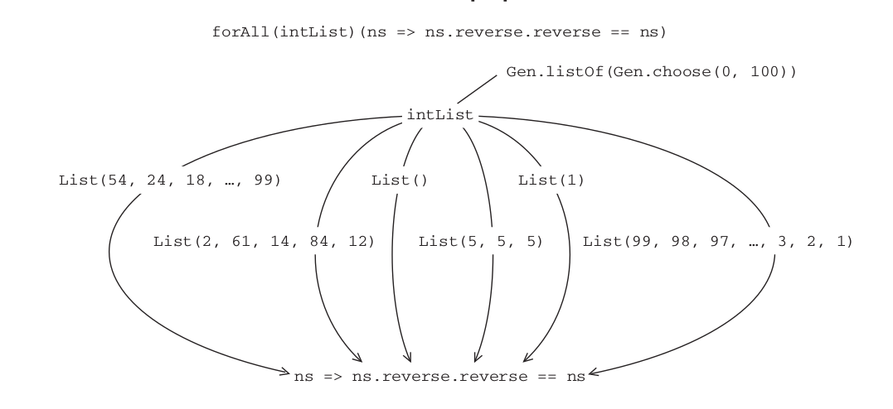

## Functional Programming in Scala
### Chapter 8 - Property-Based Testing

---

### Property-Based Testing

### What is it?


+++
- Technique for testing **laws** or **invariants** about the behaviour of your code |
- Decoupling specification of program behaviour from creation of test cases |
+++
- The programmer focuses on specifying domain, behaviour and high-level constraints |
- The framework generates test cases |

Note:
The framework then automatically generates test cases that satisfy these constraints, and
runs tests to ensure that programs behave as specified

+++

- Haskell QuickCheck

- ScalaCheck

---
### A brief tour of property-based testing


+++
```scala
val intList = Gen.listOf(Gen.choose(0,100))
val prop =
 forAll(intList)(ns => ns.reverse.reverse == ns) &&
 forAll(intList)(ns => ns.headOption == ns.reverse.lastOption)
```
@[1](A **generator** of lists of integers between 0 and 100.)
@[2](A **property** that specifies the **behavior** of the List.reverse method.)
@[3](Check that reversing a list twice gives back the original list)
@[4](Check that the first element becomes the last element after reversal.)
+++

```scala
scala> prop.check
OK, passed 100 tests
```
+++
```scala
val failingProp = forAll(intList)(ns => ns.reverse == ns)
```
A property that is obviously false
+++

```scala
scala> failingProp.check
! Falsified after 6 passed tests.
> ARG_0: List(0, 1)
```
+++
### Generators, predicates & properties

###### Gen generates a variety of objects to pass to a Boolean expression searching for one that makes it false
+++
### Exercise 8.1
#### What properties specify sum?
```scala
sum: List[Int] => Int
```
- Reversing a list and summing it should give the same result as summing the original nonreversed list |
- What should the sum be if all elements of the list are the same value? |
Note:
just high-level description
+++
### Exercise 8.2
#### What about max?
```scala
max: List[Int] => Int
```
- The max of the empty list is unspecified and should throw an error or return None |
- The max of a single element list is equal to that element. |
- The max of a list is greater than or equal to all elements of the list. |
- The max of a list is an element of that list. |
+++
### Other features
- Test case minimization
- Exhaustive test case generation
Note:
- Test case minimization—In the event of a failing test, the framework tries smaller
sizes until it finds the smallest test case that also fails, which is more illuminating
for debugging purposes. For instance, if a property fails for a list of size 10, the
framework tries smaller lists and reports the smallest list that fails the test.
- Exhaustive test case generation—We call the set of values that could be produced
by some Gen[A] the domain. 2 When the domain is small enough (for instance, if
it’s all even integers less than 100), we may exhaustively test all its values, rather
than generate sample values. If the property holds for all values in a domain, we
have an actual proof, rather than just the absence of evidence to the contrary.

+++

### Choosing properties

See [Choosing properties for property-based testing](http://fsharpforfunandprofit.com/posts/property-based-testing-2/)
- "Different paths, same destination" - combining operations in different orders |
- "There and back again" - reversing operations |
- Checking invariants |
- Idempotence |
- "Hard to prove, easy to verify" - maze solution checker |
- test oracle (test vs another implementation) |


---


### Choosing data types and functions


+++
The messy and iterative process of discovering data types and functions for our library

#### Initial snippets of the API
##### What data types should we use?
```scala
val intList = Gen.listOf(Gen.choose(0,100))
val prop =
 forAll(intList)(ns => ns.reverse.reverse == ns) &&
 forAll(intList)(ns => ns.headOption == ns.reverse.lastOption)
```
@[1](Looks like these should be choose: `Gen[Int]` , listOf: `Gen[List[Int]]`)
+++
#### Gen
Let's make `listOf` polymorphic
```scala
def listOf[A]​(a: Gen[A]): Gen[List[A]]
```
- But we can see from signature that it can't be told the size... |
+++
listOf with size:
```scala
def listOfN[A]​(n: Int, a: Gen[A]): Gen[List[A]]
```
- useful to have this, but we might not want to have to specify it |
- probably don't want size to be exposed to user, just test runner, for minimization|
- will keep it in mind... |
+++

#### What about forAll ?
We can define signature:
```scala
def forAll[A]​(a: Gen[A])(f: A => Boolean): Prop
```
so a **Prop** binds a **Gen** to a **predicate**

Note:
The forAll function looks interesting. We
can see that it accepts a Gen[List[Int]] and what looks to be a corresponding predi-
cate, List[Int] => Boolean . But again, it doesn’t seem like forAll should care about
the types of the generator and the predicate, as long as they match up. We can express
this with the type:


---


#### Meaning and API of properties
We don't know what **Prop** will look like yet but we know it needs an **&&** combinator
```scala
trait Prop {def &&(p: Prop): Prop }
```
+++
#### Prop
... and we know it needs **check**
```scala
trait Prop {
  def check: Unit
  def &&(p: Prop): Prop
}
```
- .. But because it returns **Unit**, the only option for **&&** is to run both **check** methods |
- which would suck |
+++
.. so let's try returning Boolean..
```scala
trait Prop {
  def check: Boolean
  def &&(p: Prop): Prop
}
```
### Exercise 8.3
#### Implement && on Prop
+++

```scala
object Prop {
  type SuccessCount = Int
  ...
}
trait Prop { def check: Either[???, SuccessCount] }
```
@[2](Alias helps readability of API)
+++

```scala
object Prop {
  type FailedCase = String
  type SuccessCount = Int
}
```
@[2](A String representation will do for a failure)
+++
```scala
trait Prop {
  def check: Either[(FailedCase, SuccessCount), SuccessCount]
}```
returns either:
- Failure case description and Success count before failure, |
- or just total success count |
+++

Do we have enough information here to generate values?

```scala
def forAll[A]​(a: Gen[A])(f: A => Boolean): Prop
```
- Hard to know without a closer look at Gen |


---


#### Meaning and API of Generators

```scala
Gen[A]
```
- Knows how to generate values of type A
- Do we know a way to randomly generate values in a purely functional way?
- How can we represent it?
+++
#### Remember Irek's [Purely functional state ?](https://docs.google.com/presentation/d/1Q1DfELS6b2xTfvRYDx0VQRhpTX8c2085ScbvUjsfn6I/edit#slide=id.g2316352f05_0_99)  

+++
#### A representation for Gen
```scala
  case class Gen[A] (sample: State[RNG, A])
```
It simply wraps `State[RNG,A]` so combinators should be simple delegations to State
+++
### Exercise 8.4
#### Implement choose using this representation of Gen
```scala
def choose(start: Int, stopExclusive: Int): Gen[Int]
```
+++
### Exercise 8.5
#### Try implementing `unit`, `boolean`, `listOfN`
```scala
// always generates value a
def unit[A]​(a: => A): Gen[A]​
def unit[A](a: => A):Gen[A]

def boolean: Gen[Boolean]

// generates lists of length n using generator g
def listOfN[A](n: Int, g: Gen[A]): Gen[List[A]]
```
+++
#### Think about what is primitive or derived
- If we can generate a single `Int` in some range do we need a new primitive for `(Int,Int)` pair? |
- Can we produce `Gen[Option[A]]` from a `Gen[A]`? |
- Can we generate strings using existing primitives? |

---
### Generators that depend on generated values

```scala
// generates pairs of strings - second contains chars from first
val strCharPairs : Gen[(String, String)]


val listLengthGenerator: Gen[Int]

val doubleLists: Gen[List[Double]] //generates lists of lengths from listLengthGenerator
```
How can we combine them?

+++
#### Looks like we could use a
`flatMap`...
+++
### Exercise 8.6
#### Implement flatMap and a dynamic listOfN
```scala
case class Gen[A] (sample: State[RNG, A]) {
  ...
  def flatMap[B](f: A => Gen[B]): Gen[B]
  def listOfN(size: Gen[Int]): Gen[List[A]]

}
```
+++
### Exercise 8.7
#### Implement `union` - pulls from each with equal likelihood
```scala
case class Gen[A] (sample: State[RNG, A]) {
  ...
  def union[A](g1: Gen[A], g2: Gen[A]]): Gen[A]
}
```
+++
### Exercise 8.8
#### Implement `weighted`
A version of union that accepts a weight for each Gen and generates values from each Gen with probability proportional to its weight.

```scala
case class Gen[A] (sample: State[RNG, A]) {
  ...
  def union[A](g1: Gen[A], g2: Gen[A]]): Gen[A]
}
```
---
### Back to Prop

Currently our **Prop** looks like this:

```scala
trait Prop {
  def check: Either[(FailedCase, SuccessCount), SuccessCount]
}```

Any trait that implements a single no-args method returning **A** is equivalent to a non-strict (lazy) **A**)
+++
### Back to Prop


```scala
trait Prop {
  def check: Either[(FailedCase, SuccessCount), SuccessCount]
}```
so **Prop** is currently a lazy Either |
+++
```scala
trait Prop {
  def check: Either[(FailedCase, SuccessCount), SuccessCount]
}```
What's missing?
- We don't know how to specify what constitutes "success" - "how many test cases need to pass"? |
- rather than hardcode, we'll abstract over the dependency:
+++
